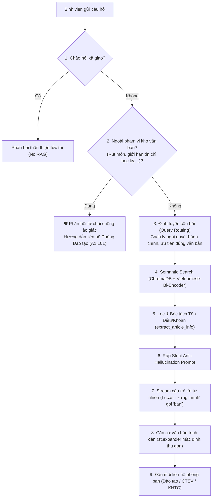

# 🎓 VLUTEBOT - Trợ lý Lucas
### Hệ thống AI Tra cứu Quy chế Đào tạo & Quy định Sinh viên - Trường Đại học Công nghệ Kỹ thuật Vĩnh Long

[](https://streamlit.io/)
[](https://www.langchain.com/)
[](https://www.trychroma.com/)
[](https://ollama.ai/)
[](https://huggingface.co/bkai-foundation-models/vietnamese-bi-encoder)

---

## 📌 Giới thiệu Dự án
**VLUTEBOT (Trợ lý Lucas)** là ứng dụng hỏi đáp thông minh ứng dụng kỹ thuật **RAG (Retrieval-Augmented Generation)** tiên tiến, được thiết kế chuyên biệt cho sinh viên và cán bộ **Trường Đại học Công nghệ Kỹ thuật Vĩnh Long (VLUTE - tiền thân: Trường ĐH Sư phạm Kỹ thuật Vĩnh Long)**.

Hệ thống cho phép tra cứu chuẩn xác, tức thì các nội dung liên quan đến:
- 🏆 **Học bổng & Khen thưởng:** Tiêu chuẩn và điều kiện xét cấp học bổng khuyến khích học tập (QĐ 201).
- 💰 **Học phí & Chính sách:** Chế độ chính sách miễn giảm học phí (QĐ 904) và quy trình hoàn trả học phí thừa (QT-SV-04).
- 🤝 **Tín chỉ Công tác xã hội:** Tiêu chí tham gia và tích lũy đủ 5 tín chỉ CTXH để đủ điều kiện xét tốt nghiệp (QĐ 55).
- 📋 **Quy chế Công tác sinh viên:** Quyền lợi, nghĩa vụ, khen thưởng và kỷ luật (QĐ 1079).
- 🛡️ **Quy tắc ứng xử & An toàn thông tin:** Văn hóa học đường và bảo mật tài khoản sinh viên.

---

## 🏗️ Kiến trúc Kỹ thuật & Cơ chế Chống Ảo giác (Anti-Hallucination)



### Các đột phá kỹ thuật chính:
1. **Triệt tiêu hoàn toàn ảo giác (Zero Hallucination):** Cách ly toàn bộ các văn bản nghị quyết nhà nước (`nghi_quyet_*.pdf`) ra khỏi Vector Database để đảm bảo dữ liệu tinh sạch 100%.
2. **Bộ chặn chủ động Out-of-Scope (`check_out_of_scope`):** Khi sinh viên hỏi về các quy định thuộc Quy chế Đào tạo tín chỉ chung (chưa có trong kho PDF), bot giải thích lịch thiệp và hướng dẫn liên hệ trực tiếp **Phòng Đào tạo (A1.101)**.
3. **Căn cứ văn bản trích dẫn thu gọn (`st.expander`):** Thu gọn toàn bộ trích dẫn vào expander, gom nhóm theo từng văn bản chính thức (QĐ 201, QĐ 904, QT-SV-04...), bấm chuột vào mới mở ra xem trang và điều khoản, tối ưu 60% không gian hiển thị trên điện thoại.
4. **Giao diện chuẩn Cổng thông tin VLUTE:** Gam màu xanh lá (`#00703c`) kết hợp 3 nhãn thân thiện (🟢 Tra cứu học vụ | 🟠 Quy chế chính thức | 🔵 Hỗ trợ 24/7), logo nhận diện trường, sidebar trượt mở và nút điều hướng 3 gạch `☰`.

---

## 📂 Cấu trúc Thư mục Dự án

```
D:\VLUTEBOT\
├── .streamlit/
│   └── config.toml         # Cấu hình giao diện Streamlit (Server port, theme màu sắc)
├── .vscode/
│   ├── settings.json       # Cấu hình môi trường Python virtualenv trong VS Code
│   └── launch.json         # Cấu hình Run/Debug Streamlit
├── data/                   # Kho 10 văn bản quy chế PDF chính thức của VLUTE
│   ├── xet_cap_hoc_bong.pdf
│   ├── quy_dinh_mien_giam_hoc_phi.pdf
│   ├── quy_trinh_hoan_tra_hoc_phi.pdf
│   ├── quy_dinh_cong_tac_sinh_vien.pdf
│   ├── tin_chi_cong_tac_xa_hoi.pdf
│   ├── quy_tac_ung_xu.pdf
│   ├── quy_che_an_toan_thong_tin.pdf
│   ├── nghi_quyet_71.pdf
│   ├── nghi_quyet_72.pdf
│   └── nghi_quyet_153.pdf
├── chroma_db/              # Cơ sở dữ liệu Vector lưu trữ embeddings
├── app.py                  # Mã nguồn ứng dụng giao diện web Streamlit
├── rag.py                  # Module lõi RAG: SmartRAGChain, DOC_CATALOG, Anti-Hallucination
├── ingest.py               # Script trích xuất PDF và xây dựng Chroma Vector Database
├── test_pdf.py             # Script kiểm tra đọc nội dung file PDF
├── requirements.txt        # Danh mục các thư viện Python phụ thuộc
├── .gitignore              # Bộ lọc bỏ qua môi trường ảo và cache khi commit Git
└── README.md               # Tài liệu hướng dẫn toàn diện dự án
```

---

## 🚀 Hướng dẫn Cài đặt & Vận hành

### 1. Yêu cầu Tiên quyết
- **Hệ điều hành:** Windows 10/11, Linux hoặc macOS
- **Python:** Phiên bản 3.10 trở lên (khuyến nghị 3.11 / 3.12)
- **Ollama:** Đã cài đặt và tải mô hình `llama3.2`
  ```bash
  ollama pull llama3.2
  ollama run llama3.2
  ```

### 2. Thiết lập Môi trường Ảo & Cài đặt Thư viện
```powershell
# Di chuyển vào thư mục dự án
cd D:\VLUTEBOT

# Tạo môi trường ảo (nếu chưa có)
python -m venv .venv

# Kích hoạt môi trường ảo trên Windows PowerShell
.\.venv\Scripts\Activate.ps1

# Cài đặt tất cả thư viện cần thiết
pip install -r requirements.txt
```

### 3. Nạp Dữ liệu & Xây dựng Vector Database (Ingestion)
*(Chỉ cần chạy khi có thêm văn bản PDF mới trong thư mục `data/`)*
```powershell
python ingest.py
```

### 4. Khởi chạy Ứng dụng
```powershell
streamlit run app.py
```
Sau khi khởi chạy thành công, truy cập trình duyệt tại: **`http://localhost:8501`**

---

## 📞 Đầu mối Liên hệ Hỗ trợ tại VLUTE

- 🏢 **Phòng Đào tạo (A1.101 - Tòa nhà Điều hành):**
  - Điện thoại: `(0270) 3822 141` | Email: `daotao@vlute.edu.vn`
- 🏢 **Phòng Công tác Sinh viên (A1.102 - Tầng trệt Tòa nhà Điều hành):**
  - Điện thoại: `(0270) 3862 436` | Email: `ctsv@vlute.edu.vn`
- 🏢 **Phòng Kế hoạch - Tài chính (Tầng trệt Tòa nhà Điều hành):**
  - Điện thoại: `(0270) 3822 141` | Email: `khtc@vlute.edu.vn`

---

## 🏛️ Thông tin Chung & Cổng Dịch vụ Trực tuyến

- **Tên trường:** Trường Đại học Công nghệ Kỹ thuật Vĩnh Long *(tiền thân: Trường Đại học Sư phạm Kỹ thuật Vĩnh Long)*
- **Tên tiếng Anh:** Vinh Long University of Technology and Engineering (VLUTE)
- **Địa chỉ:** Số 73 Nguyễn Huệ, Phường Long Châu, Tỉnh Vĩnh Long
- **Điện thoại:** `(0270) 3822 141` | **Fax:** `(0270) 3821 003`
- **Email:** `spktvl@vlute.edu.vn` | **Website:** [vlute.edu.vn](https://vlute.edu.vn/)

### Dịch vụ Tiện ích & Truy cập Nhanh
- 🌐 **My VLUTE:** [vlute.edu.vn](https://vlute.edu.vn/)
- 🎯 **Tuyển sinh:** [tuyensinh.vlute.edu.vn](https://tuyensinh.vlute.edu.vn/)
- 👥 **Công tác Sinh viên:** [cgtdt-dsa.vlute.edu.vn](http://cgtdt-dsa.vlute.edu.vn/)
- 📋 **Phòng Đào tạo:** [pdt.vlute.edu.vn](http://pdt.vlute.edu.vn/)
- 📝 **Đăng ký Học phần:** [daotao.vlute.edu.vn/sinh-vien](https://daotao.vlute.edu.vn/sinh-vien)
- 🖥️ **Hệ thống Quản lý:** [htql.vlute.edu.vn](https://htql.vlute.edu.vn/)
- 💻 **E-Learning:** [elearning.vlute.edu.vn](http://elearning.vlute.edu.vn/)
- 💳 **Cổng Thanh toán:** [thanhtoan.vlute.edu.vn](https://thanhtoan.vlute.edu.vn/)

---
*© Bản quyền thuộc về Trường Đại học Công nghệ Kỹ thuật Vĩnh Long (VLUTE - tiền thân: Trường ĐH Sư phạm Kỹ thuật Vĩnh Long) | Copyright belongs to Vinh Long University of Technology and Engineering.*
